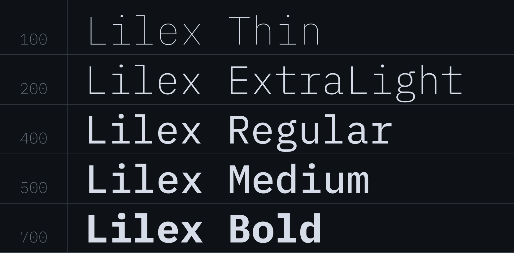
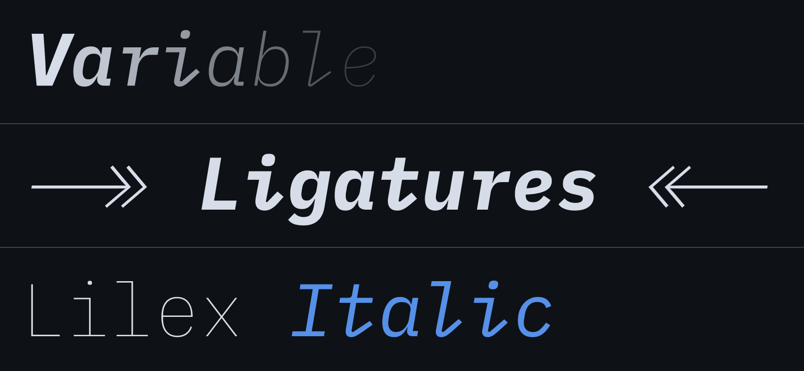
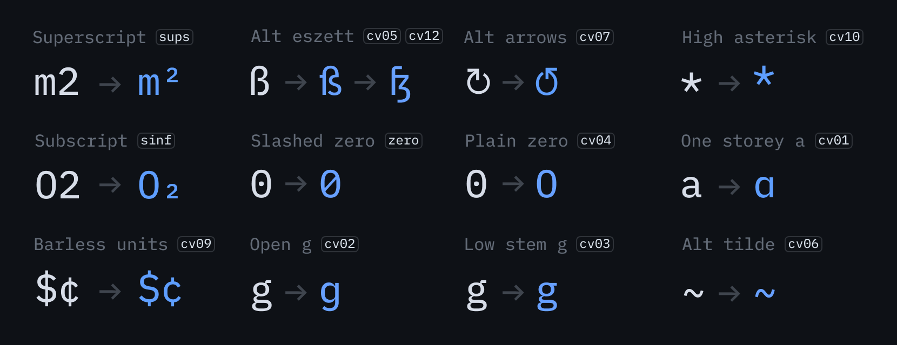

<p align="center">
    <br/>
    <a href="https://github.com/mishamyrt/Lilex/actions/workflows/qa.yaml">
        
    </a>
    <a href="https://github.com/mishamyrt/Lilex/releases/latest">
        
    </a>
<p>
<hr>

Lilex is an extended font on top of [IBM Plex Mono](https://github.com/IBM/plex) designed for developers. It contains ligatures, special characters (e.g. PowerLine), Greek and exists in a variable format.

Ligatures is just a font rendering feature: underlying code remains ASCII-compatible. This makes it easier to read and understand the code. In some cases, the ligatures connect closely related characters (`==`, `---`), while in others they optically align the glyphs (`..`, `??`).

Compiled versions are available under [releases](https://github.com/mishamyrt/Lilex/releases). Bleeding edge builds can be downloaded in the [build](https://github.com/mishamyrt/Lilex/actions/workflows/build.yaml) workflow artifacts.

## Installation

1. [Download font](https://github.com/mishamyrt/Lilex/releases/latest).
2. Unzip the archive.
3. Install the font:
   - Mac: Select all font files in the `variable` folder and double-click them. Click the `Install Font` button.
   - Windows: Select all font files in the `variable` folder, right-click any of them, then click `Install` from the menu.

### Visual Studio Code

1. From the `Code` menu (`File` on Windows) go to `Preferences` → `Settings`, or use keyboard shortcut <kbd>⌘</kbd>+<kbd>,</kbd> (<kbd>Ctrl</kbd>+<kbd>,</kbd> on Windows).
2. In the `Editor: Font Family` input box type `Lilex`.
3. To enable ligatures, go to `Editor: Font Ligatures`, click `Edit in settings.json`, and copy `"editor.fontLigatures": true` into file.

If you want to enable stylistic sets, list them instead of `true`. Like:

```json
"editor.fontLigatures": "'calt', 'ss02', 'ss04'"
```

### Cursor

Same as Visual Studio Code, but menu `Settings` → `VS Code Settings`

### iTerm2

1. From the `iTerm2` menu go to `Settings`. Under `Profiles`, find the `Text` tab.
2. If you have more than one profile, select the one you want to change. Or change the default one (with an asterisk).
3. Click on the font name under the 'Font' heading, find `Lilex` and select it.

### Ghostty

1. From the `Ghostty` menu go to `Settings…`, or use keyboard shortcut <kbd>⌘</kbd>+<kbd>,</kbd>.
2. Add `font-family = Lilex` to config file.
3. Restart Ghostty (or reload configuration with <kbd>⌘</kbd>+<kbd>Shift</kbd>+<kbd>,</kbd>)

## Weight

There are 5 font weights available in Lilex, ranging from Thin to Bold. In addition, a variable font is available.



## Italics

Lilex comes with a full set of italics: all weights, ligatures, PowerLine. Lilex Italic can do everything that Lilex does.



## Character Set

The font has support for Latin, Cyrillic and Greek. It also includes ligatures and powerline symbols.


A full glyph table can be found on the [preview page](https://mishamyrt.github.io/Lilex/).

## Features

The font has additional styles for some characters, so it can be configured to better fit your needs. Instructions on how to activate OpenType features in your IDE can be found on the internet, or [build your own variation](#forced-feature-activation) of the font with forced features



Some ligatures also have additional options. For example, certain arrows are initially switched off to avoid conflicts with logical operations.


### Arrows

Lilex uses generated ligatures for arrows, so they can be infinite. Combine that to assemble your unique arrows.

There is also a full set of single-character arrows (`↑`, `↓`, etc.) in the font.


## Development

If you want to make improvements to the project, see [CONTRIBUTING.md](CONTRIBUTING.md).

## License

Lilex typeface is available under the [OFL-1.1 License](https://github.com/mishamyrt/Lilex/blob/master/OFL.txt) and can be used free of charge, for both commercial and non-commercial purposes.

The source code is available under [Apache 2.0 License](https://www.apache.org/licenses/LICENSE-2.0).

## Credits

- Author: Mikhael Khrustik
- Based on: [IBM Plex Mono](https://github.com/IBM/plex)
- Inspired by: [Fira Code](https://github.com/tonsky/FiraCode)
