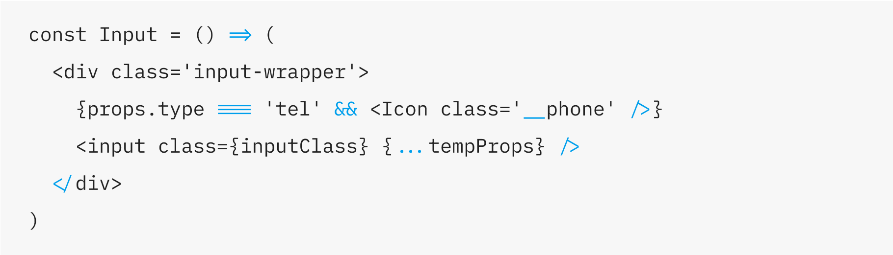

    

<h2 align="center">
    monospaced font with programming ligatures
</h2>

Lilex is the font containing a set of ligatures from for common programming multi-character combinations. This is just a font rendering feature: underlying code remains ASCII-compatible. This helps to read and understand code faster. For some frequent sequences like .. or //, ligatures allow us to correct spacing.

Compiled version are available under [releases](https://github.com/mishamyrt/Lilex/releases)

## Examples

### JavaScript

## Credits

-   Author: Mikhael Khrustik
-   Based on: [IBM Plex Mono](https://github.com/IBM/plex)
-   Inspired by: [Fira Code](https://github.com/tonsky/FiraCode)
