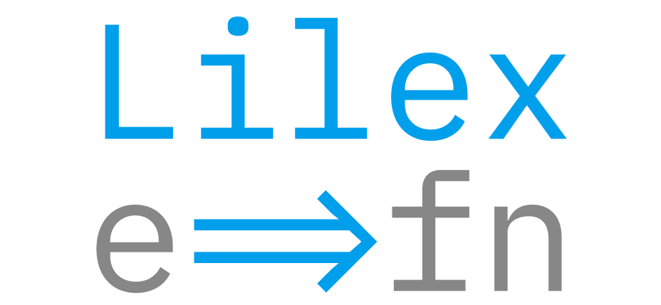

<p align="center">
    
<p>

Lilex is the modern programming font containing a set of ligatures for common programming multi-character combinations.

This is just a font rendering feature: underlying code remains ASCII-compatible. This helps to read and understand code faster. For some frequent sequences like .. or //, ligatures allow us to correct spacing like kerning pairs.

Compiled versions are available under [releases](https://github.com/mishamyrt/Lilex/releases).

## Examples

### JavaScript (JSX)


### PHP


### Go


## Stylistic sets

Additional features are available in the font, which are disabled by default.


## Build

At the moment building is possible on Ubuntu and macOS. First, install the build dependencies.

```sh
sudo make bootstrap
```

Now run the command to build it.

```sh
make
```

## Credits

-   Author: Mikhael Khrustik
-   Based on: [IBM Plex Mono](https://github.com/IBM/plex)
-   Inspired by: [Fira Code](https://github.com/tonsky/FiraCode)
